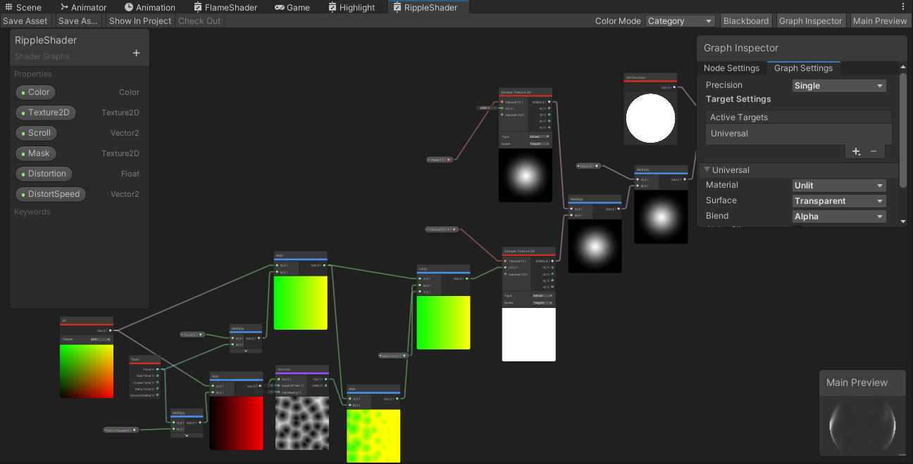
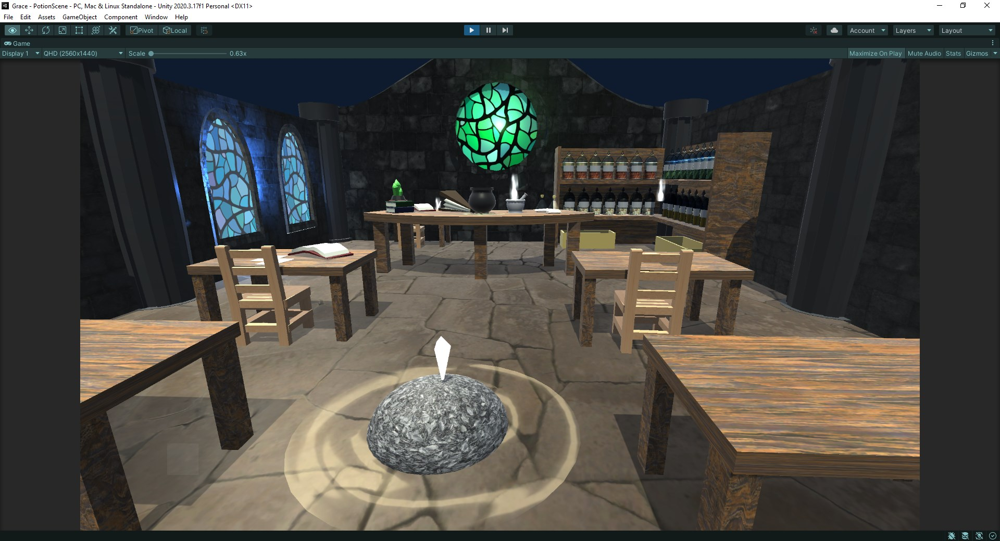

I've always been on the fence of whether I wanted to pursue the artistic or technical side of game development. I'm very surprised then, that I haven't picked up the hobby of visual effects work sooner. It's a cool mix of both where you program graphics shaders to make cool effects. This particular effect I got from following a tutorial on waterfalls, repurposed to use as a recreation of a "site of grace" from the game Elden Ring.

The shader was made with the "shader graph" extension in Unity, which is a visual style of programming to make HLSL (High level Shader Language) files. In the past I probably would have scoffed at the "drag and drop" style of coding, opting to go strictly through typing. However, I now absolutely believe in its merits. You still need the computational thinking required of all coders, and the visuals provided help immensely for the art process.

I later put the shader into a room I 3D modeled by myself for another school project, along with a character controller to move around in the scene.

