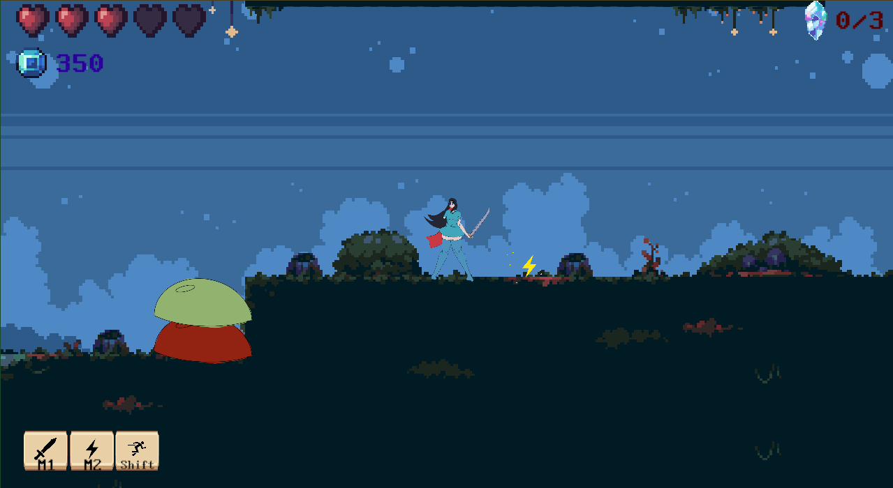

My final project for ICS 485. This is an action platformer where you can take spells from your enemies to use as your own. Created in a group of 4, I was responsible for the coding of the game along with one other of my group mates.
Specifically I was mainly responsible for the spell system of the game, which uses a Unity prefab based command pattern to allow developers to quickly implement a large number of spells.

Play the game <a href="https://skittflash.itch.io/arcane-pilferers">here</a>

