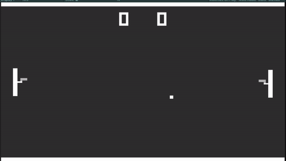

My very first Unity project I tried without the help of any tutorial. While I do believe looking things up and learning from others is absolutely essential, it felt very liberating to make something with the training wheels off.

Even something as simple as pong has a lot of interesting challenges to work through. The ball needs to bounce in a way you'd expect, but simply "reflecting" its velocity the other way gets boring. A small amount of skew needed to be added to the speed and angle after every rally to make things a bit more interactive. Agaisnt an AI that always returns the ball, you might as well be playing agaisnt a brick wall. The computer had to be just good enough to return most balls, but just slow enough to miss some, all while not looking super jittery doing it.

And the gun part just seemed funny.
