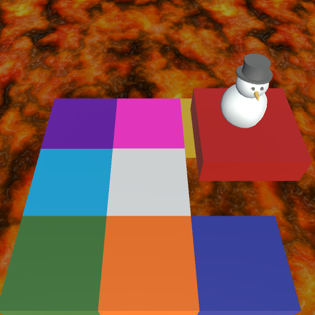

My final project for ICS 369. Yet another recreation of a small game I really enjoyed as a child. What I really enjoyed from this one was putting my ideal "trifecta" of hobbies to work. The game was programmed entirely by me in unity, with a quick, repetitive bass line I made in FL Studio to accompany a snowman I modeled in my ACM 215 class *very* recently. The model was actually made weeks after the game was. Being able to quickly replace it from the original capsule placeholder, without the game completely breaking, was a proud moment for me. Turns out decoupling code can be pretty helpful!
 
Another thing I learned about myself was that coding concepts are *much* easier for me to pick up when I apply them to something I'm really interested in. The concept of coroutines, particle systems, or events and delegates, seemed absolutely foreign to me when I heard of them. But when I see how they can be used in a game development context, it's still difficult, but I find I'm much more invested in the learning process. "How could I use this to make games?" is a question I'll have to ask myself more going forward, and I believe almost any concept in programming or other parts of software development can carry over when you think about it hard enough. 

Play the game <a href="https://play.unity.com/mg/other/sizzling-squares">here</a>

