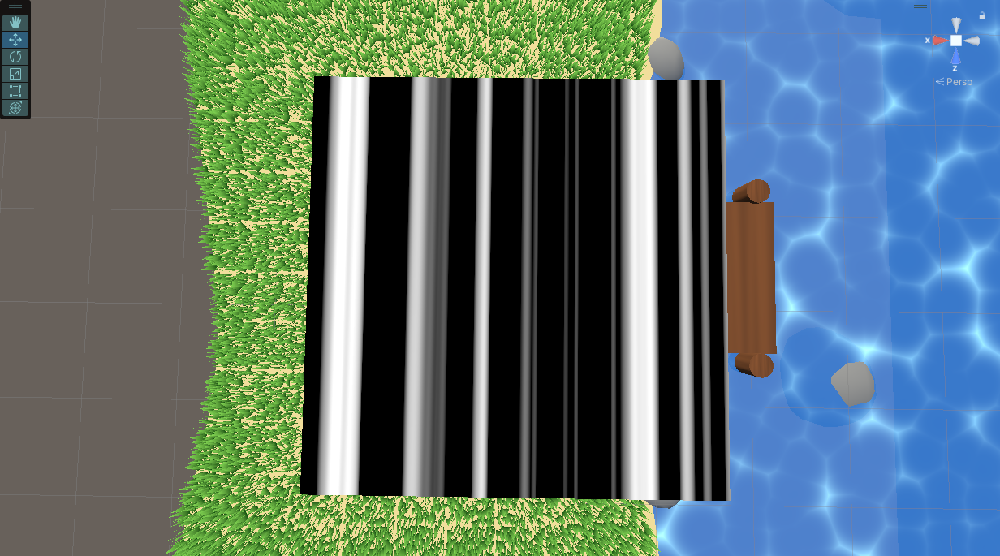

Created for my final project for a computer graphics class, this grass is made using HLSL shader code. The code is excuted on the GPU and draws blades of grass over a canvas that I 3D modeled in Blender.

The animation of the grass uses a my own custom perlin noise function which allows the grass to blow in a random yet smooth manner.

By exposing variables to the unity editor I can change various properties of the grass on the fly.

Check out a demo video <a href="https://drive.google.com/file/d/1C1jSkhTgfmfDqIGWXnHTHS_yJPbRoIxc/view?usp=drive_link">here</a>
