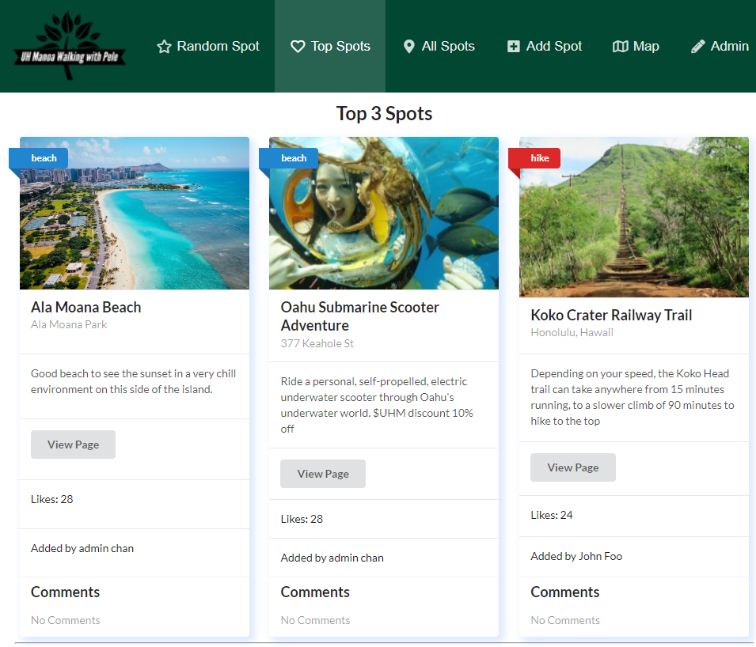

Walking with Pele is a web app created as my final project for my Software Engineering class. Our team of five students made an app to show off cool beaches, hikes and activities students can check out on Oahu. My main contributions were implementing a search feature to filter out a list of spots and a database collection that pairs spots to users to implement a "like" functionality seen on most social media sites.

Being my very first group programming project, it was a great experience that I'm looking forward to gaining more practice in the future. Proper management of a group to make sure nobody is impeding eachother's code, working on the same thing, and doing their best is an entire skill in itself. I'm very grateful to have had such a great team, and have learned that even though there's the added complexity of management, you can accomplish far more in a group than you could on your own.

View the github page <a href="https://walking-with-pele.github.io/">here</a>

