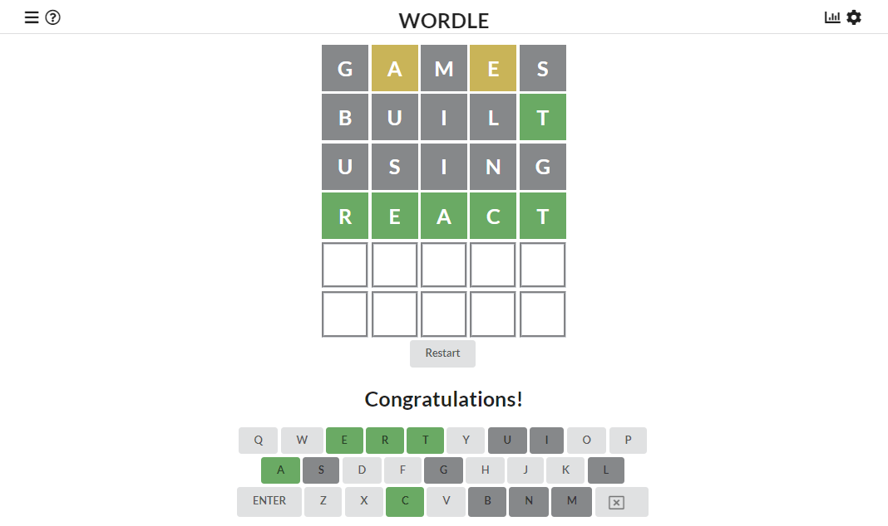

### <a href="https://donmaddock.github.io/wordle-react/">Try out my copy!</a>

## What is Wordle?

Wordle is a game made by programmer Josh Wardle for his wife, which later was sold to the New York Times for "an amount over seven figures”. You are given 6 chances to guess a five letter word, which each guess gives you clues about the letters for the word (think Mastermind with words). I believe two aspects that led to the original's success was the social and restrictive aspect of the game. In the original, the game could be only played once a day, with every player having the same word that day. Being able to share your game results on social media generates a ton of free advertisement and interactivity, and the "one a day" nature not only adds anticipation for the next day but also adds to the game's "brand". Just as Twitter limits you to 280 characters or Instagram requires you to post photos or videos, the daily restriction gave Wordle its identity.

## My Recreation

Maybe then, my recreation of the game (made as an extra credit assignment for my Software Engineering class) misses the point of it by having no shared feature and being able to play as much as you want. That said, it was probably the most fun I've ever had programming for a class. Aside from using someone else's word bank of acceptable word guesses, I used no tutorials to create the game. This is probably obvious if you looked at the messy code containing no hooks or modern react principles. Just me leveraging the "state" feature of React as well as I knew to at the time.

Some of the tiny features I'm proud of is the event listener for keyboard input, to allow users to type in answers anywhere on screen instead of a single input field, and actually attempting to use components to minimize repeating code (although there's still quite a bit of repetition in there). "Tile" components were used for each letter, and rather than having 30 different React states for each letter, only 6 were needed for each row. A typical "row" state would hold a string value such as "GUESSWYGWG" where the first five characters contain info of what letters should be in the tiles and the last 5 characters telling what each tile should be colored. Perhaps not the most efficient solution, but planning it out myself and seeing it work in code is one or those satisfying moments that keep me wanting to program.

View the github repo <a href="https://github.com/donmaddock/wordle-react">here</a>
